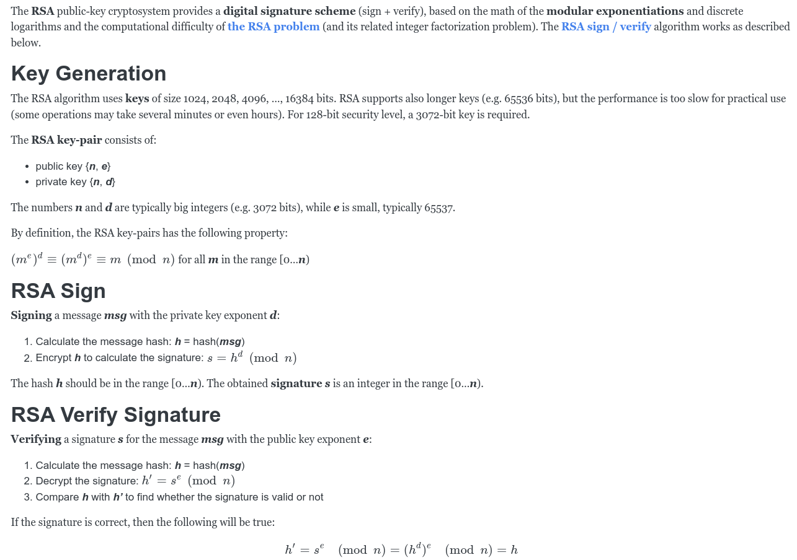

# Mina zkApp: Rsa O1js

This template uses TypeScript.

## RSA Signature 


## How to build

```sh
npm run build
```

## How to run tests

```sh
npm run test
npm run testw # watch mode
```

## How to run coverage

```sh
npm run coverage
```

## License

[Apache-2.0](LICENSE)
